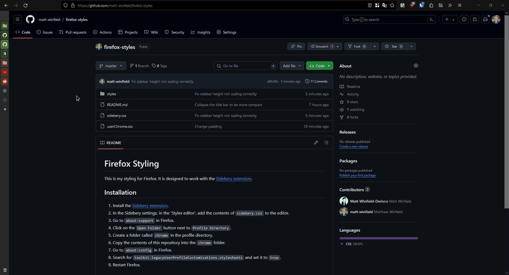

# Firefox Styling

This is my styling for Firefox. It is designed to work with the [Sidebery extension](https://addons.mozilla.org/en-US/firefox/addon/sidebery/).

## Installation

1. Install the [Sidebery extension](https://addons.mozilla.org/en-US/firefox/addon/sidebery/).
2. In the Sidebery settings, in the 'Styles editor', add the contents of `sidebery.css` to the editor.
3. Go to `about:support` in Firefox.
4. Click on the `Open Folder` button next to `Profile Directory`.
5. Create a folder called `chrome` in the profile directory.
6. Copy the contents of this repository into the `chrome` folder.
7. Go to `about:config` in Firefox.
8. Search for `toolkit.legacyUserProfileCustomizations.stylesheets` and set it to `true`.
9. Restart Firefox.

## Changes

- Remove the tab bar - Tabs are now displayed in the sidebar. The minimize/maximize/close buttons are now displayed to the side of the address bar.
- Sidebery sidebar now minimizes to a smaller size, and expands again on hover. (Based on https://github.com/Redundakitties/colorful-minimalist)

## Other Extensions

- [Dark Reader](https://addons.mozilla.org/en-US/firefox/addon/darkreader/) - Dark mode for every website.
- [uBlock Origin](https://addons.mozilla.org/en-US/firefox/addon/ublock-origin/) - An efficient blocker.
- [fxqrl](https://addons.mozilla.org/en-US/firefox/addon/fxqrl/) - A QR code generator for the current page (useful to quickly open long URLs on a mobile device during development).
- [Dark Space Improved](https://addons.mozilla.org/en-US/firefox/addon/dark-space-improved/) - Dark Space theme for Firefox, with an animated stars title bar.
- [Search Bookmarks, History and Tabs](https://addons.mozilla.org/en-US/firefox/addon/search-tabs-bookmarks-history/) - Fuzzy find in bookmarks, history and tabs.
- [tabliss](https://tabliss.io/) - New tab page
